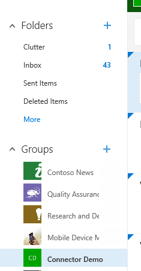
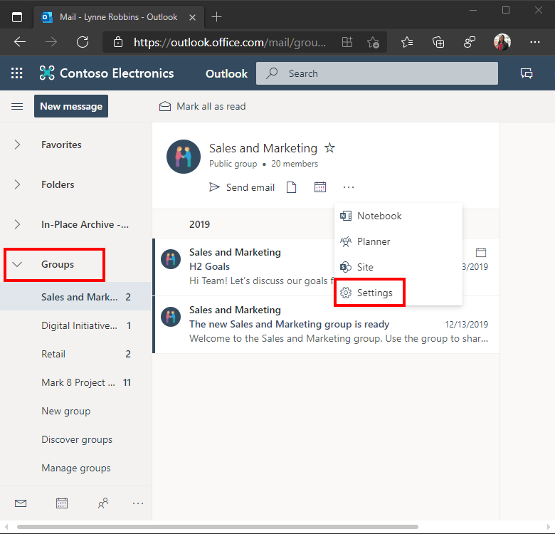

# Get started with actionable messages via email

## Create an actionable message card

Let's start by creating an actionable message card. We'll start with something simple, just a basic card with a single `OpenUri` action. We'll use the [Card Playground](https://messagecardplayground.azurewebsites.net/) to design the card.

Go to [Card Playground](https://messagecardplayground.azurewebsites.net/) and paste in the following JSON:

```json
{
  "@context": "http://schema.org/extensions",
  "@type": "MessageCard",
  "themeColor": "0072C6",
  "title": "Visit the Outlook Dev Portal",
  "text": "Click **Learn More** to learn more about Actionable Messages!",
  "potentialAction": [
    {
      "@type": "OpenUri",
      "name": "Learn More",
      "targets": [
        { "os": "default", "uri": "https://docs.microsoft.com/en-us/outlook/actionable-messages" }
      ]
    }
  ]
}
```

Feel free to experiment with this simple example in the playground. You can see the [card reference](card-reference.md) for details on the available fields. Once you have a card you're happy with, you can move on to sending it.

## Sending actionable messages via Office 365 Connectors

> [!IMPORTANT]
> In order to send actionable messages via Office 365 Connectors, your service must be [registered](https://aka.ms/gotactions) with and approved by Microsoft. If you have not yet registered or are waiting for approval, these steps will not work.

Connectors use webhooks to create Connector Card messages within an Office 365 group. Developers can create these cards by sending an HTTP request with a simple JSON payload to an Office 365 group webhook address. Let's try posting some basic cards to a group.

You'll need an Office 365 subscription to proceed. If you do not have an Office 365 subscription you can get a one year [FREE Office 365 Subscription](https://dev.office.com/devprogram) under the Office 365 Developer Program.  Alternately, if you have an existing MSDN subscription, you can activate your [free Office 365 benefit](https://msdn.microsoft.com/en-us/subscriptions/manage).

### Get the group's connector webhook URL

1. Log on to the Office 365 Mail app at [https://outlook.office.com](https://outlook.office.com). Select a group to test connector cards with.

    
  
1. Choose the **Connectors** link in the group menu.

    
  
1. Locate the **Incoming Webhook** connector in the list of available connectors, and choose **Add**.

    
  
1. Enter a name for this connector and choose **Create**.

    
  
1. Copy the webhook URL that is displayed and save it. Choose **Done**.

    
  
The webhook URL should look simliar to the following:

    https://outlook.office365.com/webhook/a1269812-6d10-44b1-abc5-b84f93580ba0@9e7b80c7-d1eb-4b52-8582-76f921e416d9/IncomingWebhook/3fdd6767bae44ac58e5995547d66a4e4/f332c8d9-3397-4ac5-957b-b8e3fc465a8c

### Send the message

Use [cURL](https://curl.haxx.se/) to post an actionable message payload. For example, to post the example payload above, use the following command:

```Shell
curl -H "Content-Type: application/json" -d "{\"@context\": \"http://schema.org/extensions\", \"@type\": \"MessageCard\", \"themeColor\": \"0072C6\", \"title\": \"Visit the Outlook Dev Portal\", \"text\": \"Click **Learn More** to learn more about Actionable Messages!\", \"potentialAction\": [{\"@type\": \"OpenUri\", \"name\": \"Learn More\", \"targets\": [{\"os\": \"default\", \"uri\": \"https://docs.microsoft.com/en-us/outlook/actionable-messages\"}]}]}" <YOUR WEBHOOK URL>
```