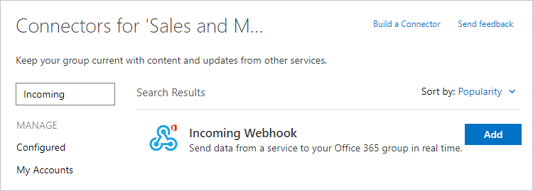
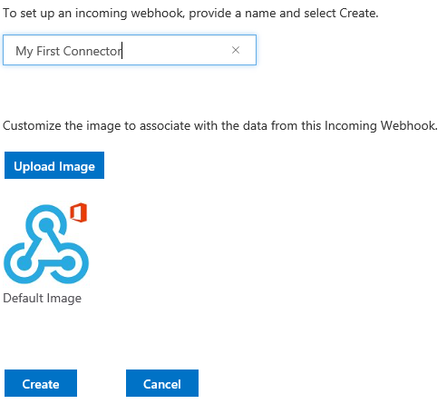
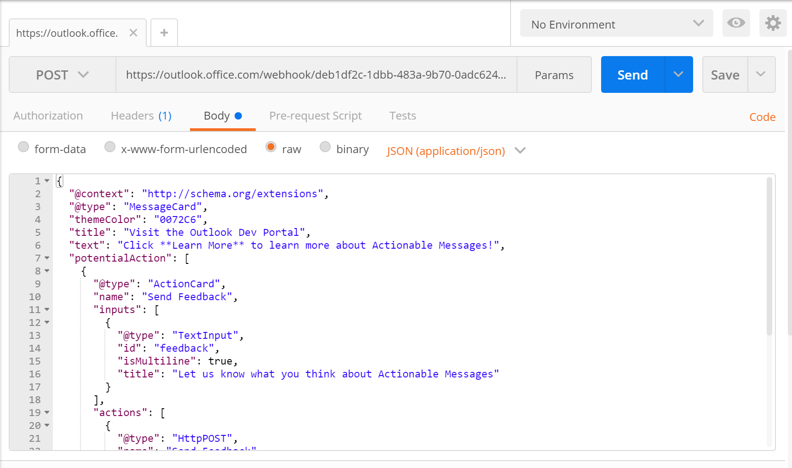

# Post an actionable message card to an Office 365 group

## Create an actionable message card

Let's start by creating an actionable message card. We'll start with something simple, just a basic card with an `HttpPOST` action and an `OpenUri` action. We'll use the [Card Playground](https://messagecardplayground.azurewebsites.net/) to design the card.

Go to [Card Playground](https://messagecardplayground.azurewebsites.net/) and paste in the following JSON:

```json
{
  "@context": "http://schema.org/extensions",
  "@type": "MessageCard",
  "themeColor": "0072C6",
  "title": "Visit the Outlook Dev Portal",
  "text": "Click **Learn More** to learn more about Actionable Messages!",
  "potentialAction": [
    {
      "@type": "ActionCard",
      "name": "Send Feedback",
      "inputs": [
        {
          "@type": "TextInput",
          "id": "feedback",
          "isMultiline": true,
          "title": "Let us know what you think about Actionable Messages"
        }
      ],
      "actions": [
        {
          "@type": "HttpPOST",
          "name": "Send Feedback",
          "isPrimary": true,
          "target": "http://..."
        }
      ]
    },
    {
      "@type": "OpenUri",
      "name": "Learn More",
      "targets": [
        { "os": "default", "uri": "https://docs.microsoft.com/en-us/outlook/actionable-messages" }
      ]
    }
  ]
}
```

Feel free to experiment with this simple example in the playground. You can see the [message card reference](message-card-reference.md) for details on the available fields. Once you have a card you're happy with, you can move on to sending it.

## Sending actionable messages via Office 365 Connectors

Connectors use webhooks to create Connector Card messages within an Office 365 group. Developers can create these cards by sending an HTTP request with a simple JSON payload to an Office 365 group webhook address. Let's try posting some basic cards to a group.

You'll need an Office 365 subscription to proceed. If you do not have an Office 365 subscription you can get a one year [FREE Office 365 Subscription](https://dev.office.com/devprogram) under the Office 365 Developer Program.  Alternately, if you have an existing MSDN subscription, you can activate your [free Office 365 benefit](https://msdn.microsoft.com/en-us/subscriptions/manage).

### Get a connector webhook URL for your Inbox

1. Log on to the Office 365 Mail app at [https://outlook.office.com](https://outlook.office.com). Click the gear icon in the upper-right-hand corner of the page, and select **Manage Integrations**.

1. Choose **Connectors** in the popup.

1. Locate the **Incoming Webhook** connector in the list of available connectors, and choose **Add**.

    

1. Enter a name for this connector and choose **Create**.

    

1. Copy the webhook URL that is displayed and save it. Choose **Done**.

    

The webhook URL should look similar to the following:

    https://outlook.office365.com/webhook/a1269812-6d10-44b1-abc5-b84f93580ba0@9e7b80c7-d1eb-4b52-8582-76f921e416d9/IncomingWebhook/3fdd6767bae44ac58e5995547d66a4e4/f332c8d9-3397-4ac5-957b-b8e3fc465a8c

### Send the message

Use [Postman](https://www.getpostman.com/) to post an actionable message payload to the webhook URL. Open Postman. Create a new tab if needed and configure the tab as follows:

- Click the **GET** and change to **POST**.
- In the text box labeled `Enter request URL` paste the webhook URL.
- Click **Body** underneath the URL, then select the **raw** option.
- Click **Text** and change to **JSON (application/json)**.
- Enter the message card JSON in the text area below.

The Postman window should look like this when you are done:



Click **Send** to post the message.