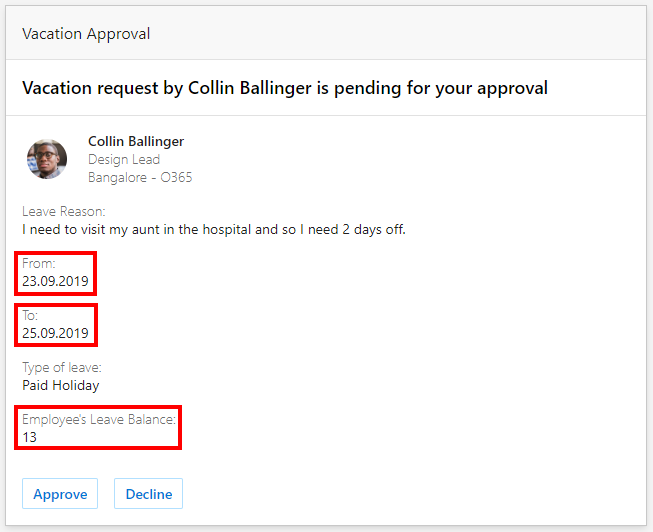
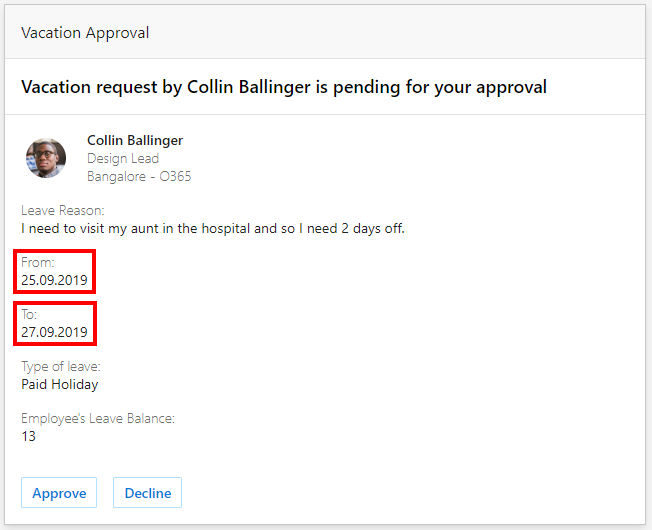

# Refresh an actionable message when the user opens it

Actionable messages allow users to take quick actions on an email message, often based on data presented in the card. However, sometimes data changes after the actionable message has been sent. For example, your service might send an actionable message to multiple approvers asking them to approve or reject a request. One approver approves the request, but the actionable message in the other approver's mailbox still asks for approval. Now, with the `autoInvokeAction` property on actionable messages, you can provide an HTTP endpoint to retrieve an up-to-date Adaptive Card payload with the latest information when the user opens the email in Outlook.

> [!IMPORTANT]
> Refreshing the actionable message when the user opens it has a direct impact on the perceived performance of your actionable message solution. It is crucial that your service that supplies the updated card meet the performance requirements described in [Implementing the Web API](#implementing-the-web-api).

## Using autoInvokeAction

In order to use this feature, your card must use the [Adaptive Card](adaptive-card.md) format. The [autoInvokeAction](adaptive-card.md#additional-properties-on-the-adaptivecard-type) property is an Outlook-specific property added to the AdaptiveCard type. The value of this property is an [Action.Http](adaptive-card.md#actionhttp) action with the `method` set to `POST`. The `url` property specifies a Web API endpoint in your service that will provide the updated Adaptive Card payload.

```json
{
  "$schema": "http://adaptivecards.io/schemas/adaptive-card.json",
  "type": "AdaptiveCard",
  "version": "1.0",
  "body": [...],
  "actions": [...],
  "autoInvokeAction": {
    "method": "POST",
    "url": "https://actionablemessages.contoso.com/api/getupdatedcard",
    "body": "",
    "type": "Action.Http"
  }
}
```

## Implementing the Web API

The URL specified in the `autoInvokeAction` must conform to the following requirements.

- The endpoint must accept POST requests.
- The endpoint should accept the contents of the `body` property within the `autoInvoke` section of the card.
- The endpoint should use the JWT sent in the `Authorization` header to [verify that requests come from Microsoft](security-requirements.md#verifying-that-requests-come-from-microsoft). - Successful requests **must return within 2 seconds**. Requests that take longer will be canceled by the client.
- Successful should return a `200 OK` status and an Adaptive Card JSON payload.

On success, the Adaptive Card returned will completely replace the existing card in the email message. If the URL returns an error or times out, the existing card will continue to display.

## Example approval scenario

Consider this example vacation request card generated by a leave request tool and sent to the employee's manager.

> [!TIP]
> You can access the JSON and modify this card sample by selecting the **Vacation Approval** sample in the [Actionable Message Designer](https://amdesigner.azurewebsites.net/).



The card includes information to help the manager make a decision, including the dates requested and how much leave the employee has remaining. This information was accurate when the message was generated and sent. However, the data could change before the manager checks his email. For example, the employee might edit his request in the leave request tool to change the requested dates.

By including an `autoInvokeAction` property on the actionable message generated by the tool, your card with the original data is replaced by a new card with new data when the manager opens it. The URL specified in the `autoInvokeAction` returns the same JSON payload, with new values for the requested vacation dates.


