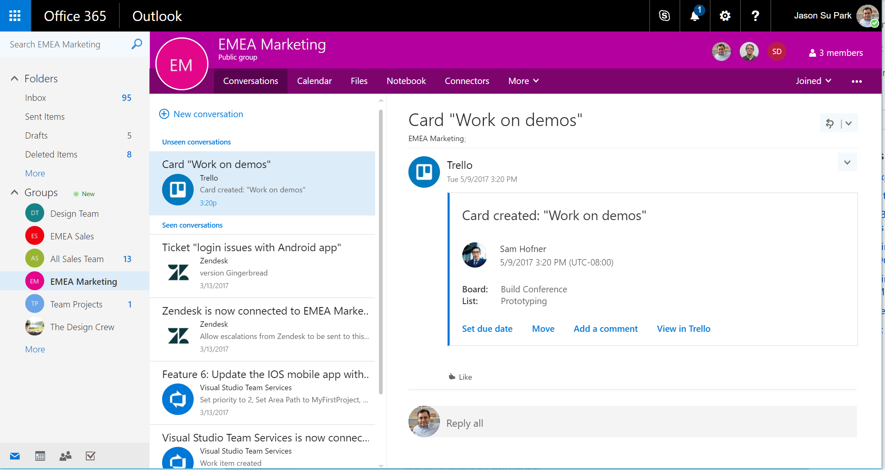
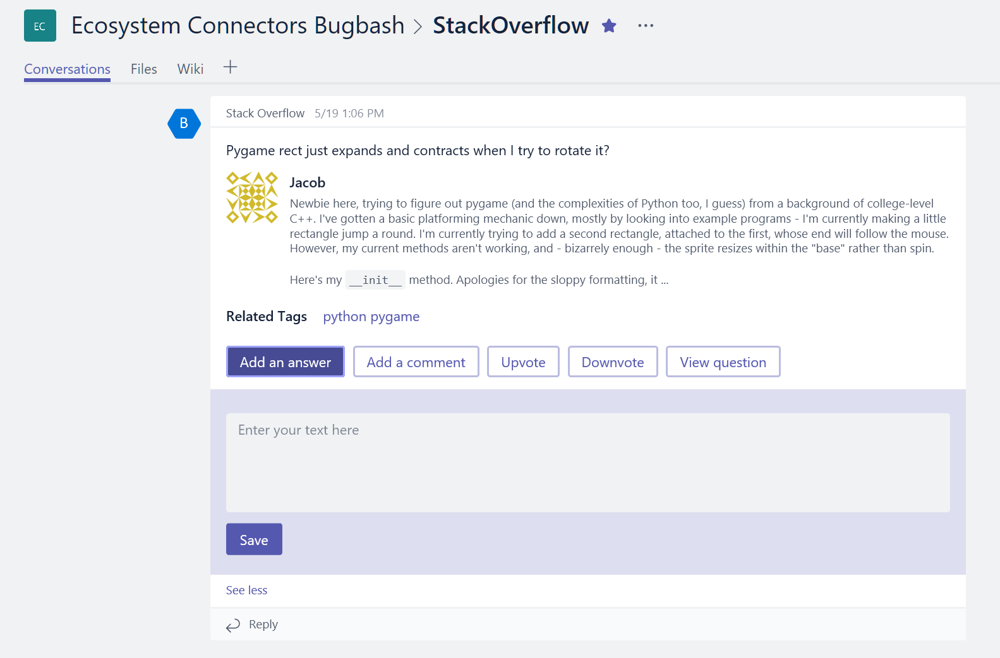

# Actionable messages in Outlook, Office 365 Groups, and Microsoft Teams

Whether you are filling out a survey, approving an expense report, or updating a CRM sales opportunity, Actionable Messages enable you to take quick actions right from within Outlook and Teams. Developers can now embed actions in their emails or notifications, elevating user engagement with their services and increasing organizational productivity.

Office 365 provides two solutions to enhance productivity with Outlook Actionable Messages: actionable messages via email, and actionable messages via Office 365 Connectors.

## User Experience

Let's take a look at the end-to-end user experience for both an email-based and a connectors-based actionable message scenario.

### Actionable messages via email: expense approval scenario

A Contoso employee submits an expense report to the internal system. That system sends an Actionable Message to the person who is to approve or reject the expense. The card included in the message contains all the information the approver might need to quickly understand who submitted the expense, the total amount, and more. It also includes **Approve** and **Reject** actions that can be taken right from Outlook:

The recipient decides to approve the request, and clicks the **Approve** action: 

Outlook makes a request to the expense report approval system, and the expense report is marked as "approved" in the system. As a result, the card is refreshed to indicate the new status of the expense report:

### Actionable messages via Office 365 Connectors: task management scenario

Adele Vance and her team use Trello as their task management system. Adele has configured the Trello connector in her account, and will receive granular notifications as activity occurs in the Trello boards she is interested in.

Shiva, in Adele's team, creates a new Trello card in the "Hiring" board. He needs the latest job postings to be published. Adele receives an actionable message that tells her all about the new card and the task it represents: who created it, in which list, what the due date is, and more.

Adele has a few notes she recently took on a piece of paper with important things that should be mentioned in the job postings. She decides to add these as a comment to the Trello card. She clicks the **Add a comment** action, and is presented with a text input field in which she can type her notes:

Adele then clicks the **Save** button, and the notes are immediately saved to the Trello card. A confirmation appears at the bottom of the message:

## Office 365 Connectors for Groups, Microsoft Teams and Yammer

Office 365 Connectors are a great way to get useful information and content into your Office 365 Groups in Outlook, Microsoft Teams and Yammer. Any user can connect their group or team to services like Trello, Bing News, Twitter, etc., and get notified of activity from that service. From tracking a team's progress in Trello, to following important hashtags in Twitter, Office 365 Connectors make it easier for an Office 365 group in Outlook, Microsoft Teams, or Yammer to stay in sync and get more done. Office 365 Connectors currently have over 80 connectors with dozen or more to be added each month.

Office 365 Connectors for Groups is broadly available in Outlook 2016, Outlook on the web and the Groups mobile app for iOS and Android. It is also available in Microsoft Teams on web, desktop, iOS and Android; and Yammer on web, desktop, iOS and Android. 

Office 365 Connectors also provide a compelling extensibility solution for developers. Developers can build connectors through incoming webhooks to generate rich connector cards. Additionally, with the new "Connect to Office 365" button, developers can embed the button on their site and enable users to connect to Office 365 groups. Try them today as part of our general availability!

## Accessing Office 365 Connectors from Outlook

Office 365 Connectors for Groups are available to any Office 365 Mail user. They are available by default when you navigate to any Group from Outlook on the web. To access Outlook on the web, simply connect to [https://outlook.office.com/owa](https://outlook.office.com/owa) from your favorite browser.

Once you are in the Office 365 Mail app, navigate to any Group or create a new Group first and then select **Connectors** as shown in the screenshot.

Check out our end-user documentation to learn more on how to <a target="_blank" href="https://support.office.com/en-us/article/Connect-apps-to-your-groups-ed0ce547-038f-4902-b9b3-9e518ae6fbab?ui=en-US&rs=en-US&ad=US">connect apps to your groups</a>.

## Accessing Office 365 Connectors from Microsoft Teams

From Microsoft Teams, you can easily add and configure connectors for any channel, either from the channel context menu or in the channel header.

The following is an example of an actionable message generated by the StackOverflow connector rendered in Microsoft Teams. Using the StackOverflow connector, you can subscribe to the tagged areas of interest and get notified in Outlook or Teams. Your team can stay on top of all the questions posted on StackOverflow and answer them inline in Teams (or Outlook)!

## Accessing Office 365 Connectors from Yammer

From Yammer, you can easily add and configure connectors for any O365 connected Yammer group by clicking the **Add or Remove Apps** link.

Configured connectors post cards directly in the group feed.

## Release Notes 

Currently, you can only configure connectors from Office 365 Outlook, Microsoft Teams and Yammer on the web, but you can view information posted by Connectors to your Group or Team by multiple clients such as Outlook on the web, Outlook 2016 and the Office365 Groups Mobile app; Microsoft Teams web, desktop, and iOS and Android apps; and Yammer web, desktop, iOS and Android apps.

For information on admin controls, look at the FAQ section of this <a target="_blank" href="https://support.office.com/en-us/article/Connect-apps-to-your-groups-ed0ce547-038f-4902-b9b3-9e518ae6fbab?ui=en-US&rs=en-US&ad=US">support article</a>.

### Outlook version requirements for actionable messages

Actionable messages are available to all customer mailboxes on Exchange Online in Office 365 with a supported client. The following table lists the availability of actionable messages for current Outlook clients. For information on the Office 365 release channels, see [Overview of update channels for Office 365 ProPlus](https://support.office.com/en-us/article/Overview-of-update-channels-for-Office-365-ProPlus-9ccf0f13-28ff-4975-9bd2-7e4ea2fefef4).

| Client | Actionable messages supported? | Minimum Version |
|---------|--------------------------------|-----------------|
| Outlook on the web for Office 365| Yes | Available to all Office 365 users |
| Office 365 ProPlus Monthly Channel | Yes | Version 1705, Build 8201 |
| Office 365 ProPlus Semi-Annual Channel (Targeted) | Yes | Version 1708, Build 8431 |
| Office 365 ProPlus Semi-Annual Channel | No | Coming Soon |
| Outlook 2016 for Mac | No | Coming Soon |
| Outlook for iOS | No | Coming Soon |
| Outlook for Android | No | Coming Soon |
| Office Professional Plus 2016 | No | Actionable Messages are available for Office 365 only |
| Exchange 2016 On-Premises Outlook on the web | No | Actionable Messages are available for Office 365 only |

## Submit feedback 

There are multiple ways you can send us feedback.

- The in-product **Send Feedback** link (preferred)
- Post questions to [Stack Overflow](https://stackoverflow.com/questions/tagged/Office365Connectors?sort=newest) - Tag your questions with `Office365Connectors`.
- Post feedback and suggestions to <a target="_blank" href="https://officespdev.uservoice.com/forums/224641-general/category/146379-connectors">UserVoice</a>.
