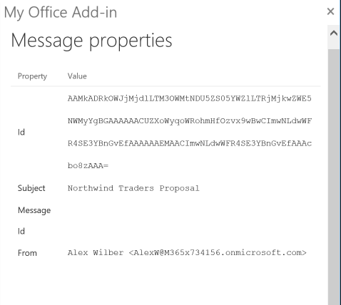

# Build your first Outlook add-in

In this article, you'll walk through the process of building an Outlook add-in by using jQuery and the Office JS API.

## Prerequisites

- [Node.js](https://nodejs.org)

If you haven't done so previously, you'll need to install [Yeoman](https://github.com/yeoman/yo) and the [Yeoman generator for Office Add-ins](https://github.com/OfficeDev/generator-office) globally.

```Shell
npm install -g yo generator-office
```

## Create the add-in

1. Create a folder on your local drive and name it `my-outlook-addin`. This is where you'll create the files for your add-in.
1. Navigate to your new folder.

    ```Shell
    cd my-outlook-addin
    ```

1. Use the Yeoman generator to create an Outlook add-in project. Run the following command and then answer the prompts as follows:

    ```Shell
    yo office
    ```

    - **Would you like to create a new subfolder for your project?:** `No`
    - **What do you want to name your add-in?:** `My Office Add-in`
    - **Which Office client application would you like to support?:** `Outlook`
    - **Would you like to create a new add-in?:** `Yes`
    - **Would you like to use TypeScript?:** `No`
    - **Choose a framework:** `Jquery`

    The generator will then ask you if you want to open resource.html. It isn't necessary to open it for this tutorial, but feel free to open it if you're curious! Choose yes or no to complete the wizard and allow the generator to do its work.

    

## Update the code

1. In your code editor, open **index.html** in the root of the project. This files contains the HTML that will be rendered in the add-in's task pane.
1. Replace the `<header>` and `<main>` elements inside the `<body>` element with the following markup and save the file.

    ```HTML
    <div class="ms-Fabric content-main">
        <h1 class="ms-font-xxl">Message properties</h1>
        <table class="ms-Table ms-Table--selectable">
            <thead>
                <tr>
                    <th>Property</th>
                    <th>Value</th>
                </tr>
            </thead>
            <tbody class="prop-table"/>
        </table>
    </div>
    ```

1. Open **app.js** in the root of the project, replace the entire contents with the following code, and save the file.

    ```js
    'use strict';

    (function () {

      // The initialize function must be run each time a new page is loaded
      Office.initialize = function (reason) {
        $(document).ready(function () {
          loadItemProps(Office.context.mailbox.item);
        });
      };

      function loadItemProps(item) {
        // Get the table body element
        var tbody = $('.prop-table');

        // Add a row to the table for each message property
        tbody.append(makeTableRow("Id", item.itemId));
        tbody.append(makeTableRow("Subject", item.subject));
        tbody.append(makeTableRow("Message Id", item.internetMessageId));
        tbody.append(makeTableRow("From", item.from.displayName + " &lt;" +
          item.from.emailAddress + "&gt;"));
      }

      function makeTableRow(name, value) {
        return $("<tr><td><strong>" + name + 
          "</strong></td><td class=\"prop-val\"><code>" +
          value + "</code></td></tr>");
      }

    })();
    ```

1. Open **app.css** in the root of the project, replace the entire contents with the following code, and save the file.

    ```CSS
    html,
    body {
        width: 100%;
        height: 100%;
        margin: 0;
        padding: 0;
    }

    td.prop-val {
        word-break: break-all;
    }

    .content-main {
        margin: 10px;
    }
    ```

## Update the manifest

1. Open the **my-office-add-in-manifest.xml** file.
1. The `ProviderName` element has a placeholder value. Replace it with your name.
1. The `DefaultValue` attribute of the `Description` element has a placeholder. Replace it with `My First Outlook Add-in`.
1. The `DefaultValue` attribute of the `SupportUrl` element has a placeholder. Replace it with `https://localhost:3000`.

```xml
...
<ProviderName>Jason Johnston</ProviderName>
<DefaultLocale>en-US</DefaultLocale>
<!-- The display name of your add-in. Used on the store and various places of the Office UI such as the add-ins dialog. -->
<DisplayName DefaultValue="My Office Add-in" />
<Description DefaultValue="My First Outlook Add-in"/>

<!-- Icon for your add-in. Used on installation screens and the add-ins dialog. -->
<IconUrl DefaultValue="https://localhost:3000/assets/icon-32.png" />
<HighResolutionIconUrl DefaultValue="https://localhost:3000/assets/hi-res-icon.png"/>

<!--If you plan to submit this add-in to the Office Store, uncomment the SupportUrl element below-->
<SupportUrl DefaultValue="https://localhost:3000" />
...
```

Save the file.

## Sideload the manifest

> [!TIP]
> There is currently an issue with the self-signed certificates generated by the Microsoft Office Project Generator which will cause browsers to report that the add-in site is not secure, and will block the add-in from loading in Outlook clients. This problem persists even after trusting the generated certificates. For more information and workarounds, see [Running add-in locally no longer works, certificate invalid](https://github.com/OfficeDev/generator-office/issues/244) on GitHub.

1. In your command prompt/shell, make sure you are in the root directory of your project, and enter `npm start`. This will start a web server at `https://localhost:3000` and open your default browser to that address.
1. If your browser indicates that the site's certificate is not trusted, you will need to add the certificate as a trusted certificate. Outlook will not load add-ins if the site is not trusted. See [Adding Self-Signed Certificates as Trusted Root Certificate](https://github.com/OfficeDev/generator-office/blob/master/src/docs/ssl.md) for details.

Once your browser loads the add-in page without any certificate errors, follow the instructions in [Sideload Outlook add-ins for testing](sideload-outlook-add-ins-for-testing.md) to sideload the **my-office-add-in-manifest.xml** file.

## Try it out

1. Once you've sideloaded the manifest, select or open a message in Outlook.
1. On the **Home** tab (**Message** tab if you opened the message in a new window), locate the add-in's **Display all properties** button.

    

1. Click the button to open the add-in's taskpane.

    

## Next steps

Congratulations, you've successfully created your first Outlook add-in! Next, learn more about the capabilities of an Outlook add-in and build a more complex add-in by following along with the Advanced Outlook add-in tutorial.

> [!div class="nextstepaction"]
> [Advanced Outlook add-in tutorial](addin-tutorial.md)