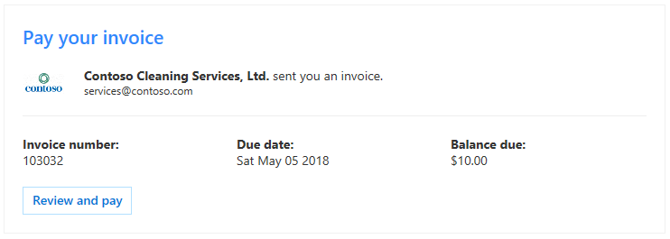

# Enabling payments in Outlook

Enabling payments in Outlook provides a powerful payment solution that allows you to send requests for payments via email that are immediately actionable by the recipient. The recipient can view their invoice, select a payment method, and approve payment, all from within Outlook.

Let's take a look at the flow for a simple invoice scenario.

## Sequence of events for sending an invoice and receiving payment

1. The merchant sends a payment request email to the recipient on Office 365.
1. The payment service validates that the sender is allowed to send payment requests before delivering to the user.
1. The user opens the message, which is rendered as a payment card.
1. The user invokes the payment action on the card.
1. The payment service POSTs a request to the merchant's server to get the invoice details and allowed payment methods.
1. The merchant uses the information in the POST to retrieve the invoice and sends it back to Outlook.
1. The user reviews the invoice, selects a payment method, and approves payment without leaving Outlook.
1. The payment service POSTs a payment token to the merchant's server.
1. The merchant processes the token using the appropriate payment processor API (Stripe, Microsoft Pay, etc.) and sends the result back to Outlook.
1. Outlook displays the result.

## Integration components

There are two major components to creating a payment integration in Outlook.

- [Payment request message](#payment-request-message) - This is an email message that includes pay-specific actions. Your service sends these specially-formatted messages to the recipient.
- [Webhook service](#webhooks) - This is a web service that implements two distinct webhooks: one that provides up-to-date invoice or checkout information, and one that accepts payment.

### Payment request message

The payment request message is an email message with an actionable card embedded in the HTML body. The card is defined by a JSON payload as specified in [ActionRequest markup reference](action-request.md).

The `ActionRequest` payload contains a `productContext` JSON dictionary, which should include the information your webhooks need to locate the corresponding invoice.

> [!IMPORTANT]
> The ability to send payment request messages to users requires registration with the [actionable email developer dashboard](../actionable-messages/actionable-email-dev-dashboard.md). The payment card markup also requires a merchant ID and display ID generated by the partner dashboard for payments in Outlook. For details, see [Get started with payments in Outlook](get-started.md).

### Webhooks

The web service implements two distinct webhooks.

- Payment request webhook: this webhook receives POSTs to load invoices. If your invoicing scenario includes prompting for a shipping address and shipping option, this webhook also receives POSTs when the user selects or changes their shipping information. This webhook returns an up-to-date invoice to be displayed in Outlook. For details, see [PaymentRequest webhook](reference.md#paymentrequest-webhook).
- Payment complete webhook: this webhook receives POSTs with payment tokens. This webhook processes payment tokens and returns success or failure to Outlook. For details, see [PaymentComplete webhook](reference.md#paymentcomplete-webhook).

## Next steps

Check out our getting started guide to learn how to implement your own payments in Outlook solution.

> [!div class="nextstepaction"]
> [Get started with payments in Outlook](get-started.md)